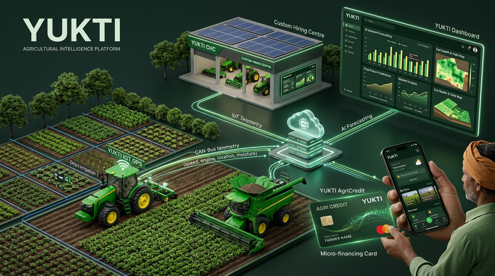
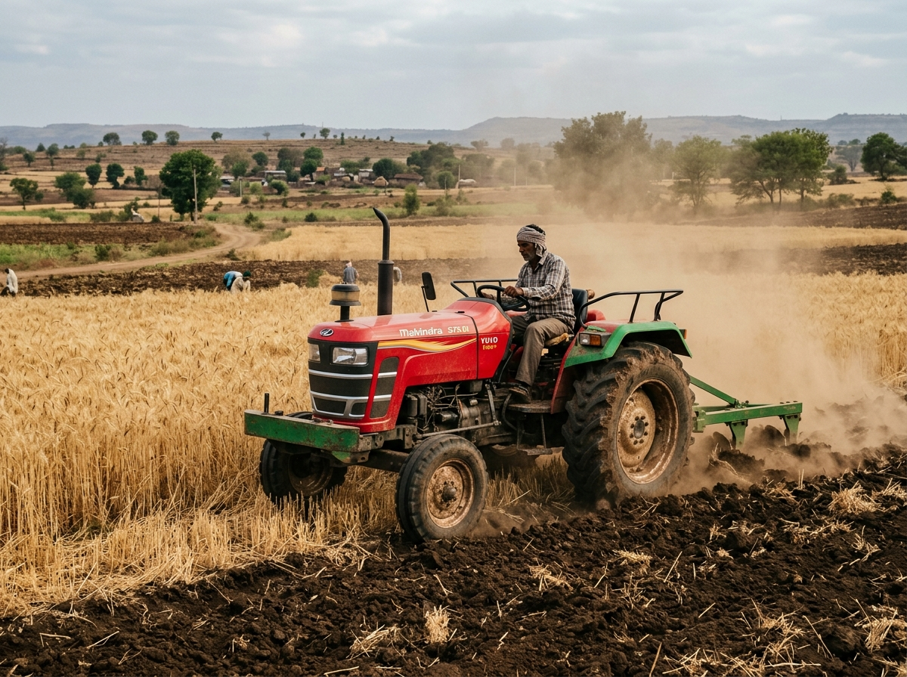
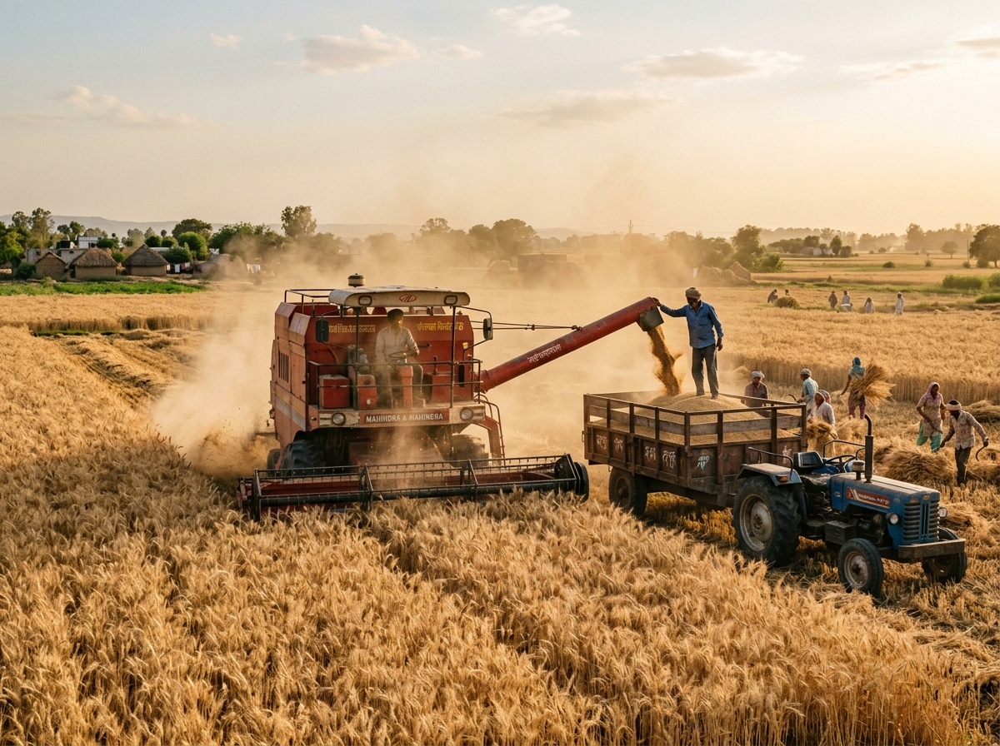

# 🌾 Yukti - An Agricultural Machinery Intelligence & CHC Operations Platform

<div align="center">
  
  <br />
  <br />
  <p align="center">
    <strong>Predict. Allocate. Operate. Settle.</strong><br />
    <em>A production-ready cloud operations platform connecting Indian farmers, Custom Hiring Centres (CHCs), machinery operators, and agronomists into a unified, high-efficiency equipment sharing economy.</em>
  </p>

  <p align="center">
    <a href="#-key-features"></a>
    <a href="#-automated-test-suite"></a>
    <a href="#-technology-stack"></a>
    <a href="#-deployment-guide-vercel"></a>
    <a href="#-database--backend-supabase"></a>
  </p>
</div>

---

## 📸 Platform Showcase Gallery

<div align="center">
  <table>
    <tr>
      <td width="33%" align="center">
        
        <br />
        <strong>Live Machine Tracking & GPS</strong><br />
        <sub>Real-time tractor speed, fuel usage, and engine sensor monitoring</sub>
      </td>
      <td width="33%" align="center">
        
        <br />
        <strong>Farmer Mobile Marketplace</strong><br />
        <sub>1-tap tractor booking, plot polygon geofencing & Pay After Harvest</sub>
      </td>
      <td width="33%" align="center">
        
        <br />
        <strong>CHC Fleet Reallocation</strong><br />
        <sub>Surplus rebalancing, dynamic pricing & regional shortage prediction</sub>
      </td>
    </tr>
  </table>
</div>

---

## 🚜 The Agronomic Challenge & Yukti Solution

In India's agricultural belt, over **85% of smallholder farmers** cannot afford high-capacity machinery (e.g. 75+ HP 4WD Tractors, Tracked Combine Harvesters, Laser Levelers). Concurrently, **Custom Hiring Centres (CHCs)** suffer from **suboptimal fleet utilization (< 32%)**, unpredictable demand surges, heavy fuel leakages, and delayed cashflow due to informal credit.

**Yukti** transforms fragmented machinery ownership into a predictable, high-efficiency shared utility:

```text
┌────────────────────────────────────────────────────────────────────────────────────────┐
│                                 YUKTI CLOSED-LOOP PIPELINE                             │
└────────────────────────────────────────────────────────────────────────────────────────┘
                                           │
  1. FARM CONTEXT & WEATHER           ───► Real-time Open-Meteo Satellite & Live Rain Radar
                                           │
  2. DEMAND FORECASTING               ───► +34% Regional Surge Alerts across District Clusters
                                           │
  3. FLEET REBALANCING                ───► Moves Idle Machinery to High-Demand CHC Centers
                                           │
  4. SMART MACHINE MATCHING           ───► 7-Factor Compatibility Fit with Explainable Reasons
                                           │
  5. MULTILINGUAL VOICE AI            ───► Natural Hindi/Hinglish Voice Booking Assistant
                                           │
  6. FLEXIBLE CHECKOUT                ───► Razorpay Standard Checkout & Pay After Harvest Credit
                                           │
  7. LIVE OPERATOR COCKPIT            ───► GPS Route Tracking, Diesel Logging & Work Timer
                                           │
  8. MACHINE SENSOR MONITORING        ───► Extra Diesel Usage & Engine Temperature Alerts
                                           │
  9. AUTOMATED GST INVOICING          ───► Dispute-Free Branded PDF Receipts with Verified Hours
```

---

## 🌟 Core System Modules

### 1. 🔮 Regional Demand Intelligence Engine
- Synthesizes regional crop stage progression (*Sowing ➔ Vegetative ➔ Flowering ➔ Harvest-Ready*), booking density, and live meteorological signals.
- Computes shortage indices across machinery categories (e.g. *5 Harvesters required vs 2 available in Sehore district*).

### 2. 🌦️ Live Open-Meteo Weather Risk Radar & RainViewer Doppler
- Connects directly to **Open-Meteo API** to fetch real-time satellite telemetry (*current temperature, humidity, wind velocity, precipitation*).
- Formulates agronomic harvest risk, distinguishes between immediate 24h rain vs 7-day cumulative rainfall, and computes soil tractability limits (*Max 18T machine weight*).
- Integrates interactive **RainViewer live Doppler satellite radar** loop for tracking incoming precipitation fronts.

### 3. 🎙️ Multilingual Voice AI Assistant (Kisan Voice)
- Built for Indian farmers with low digital literacy: farmers can speak naturally in **Hindi, Hinglish, or English** (e.g. *"मुझे कल 5 एकड़ गेहूं कटाई के लिए हार्वेस्टर चाहिए"*).
- Extracts structured intent (`cropType`, `acres`, `activity`, `date`, `urgency`), searches available inventory, recommends the top-rated machine, and synthesizes natural audio responses.

### 4. 🎯 7-Factor Explainable Smart Matching
- Ranks candidate machines using a weighted compatibility model:
  - **Task Suitability (25%)** • **Availability (20%)** • **Distance (15%)** • **Machine Health (15%)** • **Tariff Fit (10%)** • **Reliability (10%)** • **Operator Rating (5%)**
- Delivers transparent, plain-English reasons explaining why the machine fits the farmer's plot.

### 5. 💳 Pay After Harvest (AgriCredit) & Razorpay Gateway
- **AgriCredit Scoring (300–900)**: Evaluates landholding size, crop variety, and repayment reliability, granting pre-approved credit limits (up to `₹10,000`) payable within 45 days after selling produce at the APMC Mandi.
- **Razorpay Standard Checkout**: Official SDK redirection supporting UPI (Google Pay, PhonePe, Paytm), QR code scanning, RuPay/Visa/MasterCard, and NetBanking.

### 6. 📡 Live Machine GPS Tracking & Diesel Alerts
- Tracks real-time machine speed, fuel remaining (%), diesel usage rate (L/hr), engine heat (°C), and working hours.
- Automated anomaly sentinels flag diesel leaks (`+17% burn rate`) and engine heat warnings before mechanical failure occurs.

### 7. 🧾 Automated GST Billing & Branded Tax Invoices
- Dynamically reconciles booked vs verified engine runtime hours, transportation charges, and 5% GST.
- Generates downloadable, print-ready branded PDF invoices via `jsPDF` and `html2canvas`.

---

## 👥 4 Role-Based Operational Portals

| Portal | Route | Key Functionalities |
| :--- | :--- | :--- |
| 🌾 **Farmer Portal** | `/farmer` | • Machinery search & booking<br />• Farm acreage & GPS polygon setup<br />• Pay After Harvest limit tracker<br />• Live tractor GPS route map<br />• Downloadable payment receipts |
| 🏢 **CHC Hub Hub** | `/chc` | • 7-day regional demand forecasting<br />• Fleet registry & machine health scoring<br />• Inter-hub relocation approvals<br />• Live tractor sensor stream & diesel leak alerts<br />• GST revenue analytics |
| 🚜 **Machine Operator** | `/operator` | • Active job cockpit with start/pause/finish stopwatch<br />• Direct farmer call button & turn-by-turn map<br />• Digital diesel refill slip logger<br />• Breakdown & maintenance reporter<br />• Shift earnings & acreage incentive statement |
| 🛡️ **Platform Admin** | `/admin` | • Multi-district hub oversight<br />• Dynamic pricing bounds (0.80x – 1.30x)<br />• Cross-district fleet relocation approvals<br />• SMAM subsidy compliance & security audit logs |

---

## 🛠️ Technology Stack

```text
┌────────────────────────────────────────────────────────┐
│                   CLIENT ARCHITECTURE                  │
│   React 18  •  TypeScript (Strict)  •  Vite  •  Tailwind│
│   React Router v6  •  Lucide Icons  •  Leaflet GIS Maps│
│   jsPDF  •  html2canvas  •  Web Speech API (Voice AI)  │
└──────────────────────────┬─────────────────────────────┘
                           │ REST / Realtime WebSockets
┌──────────────────────────▼─────────────────────────────┐
│                    BACKEND & CLOUD                     │
│   Supabase Cloud PostgreSQL 15 (RLS, PostGIS, UUIDs)   │
│   Supabase Auth & Realtime Channels                    │
│   Supabase Edge Functions (Deno Telemetry Webhook)     │
└──────────────────────────┬─────────────────────────────┘
                           │ APIs & Gateways
┌──────────────────────────▼─────────────────────────────┐
│                 EXTERNAL INTEGRATIONS                  │
│   Open-Meteo Weather API (Real-time Satellite Forecast)│
│   RainViewer Doppler Satellite Telemetry               │
│   Razorpay Standard Checkout Payment Gateway           │
│   OpenStreetMap & CartoDB Tile Services                │
└────────────────────────────────────────────────────────┘
```

---

## ⚡ Quickstart & Local Setup

### Prerequisites
- **Node.js**: `v18.0.0+` or `v20.0.0+`
- **npm**: `v9.0.0+`

### 1. Clone & Install
```bash
git clone https://github.com/your-org/KisanOps.git
cd KisanOps
npm install
```

### 2. Configure Environment Variables
Create a `.env` file in the root directory:

```env
# Supabase Configuration
VITE_SUPABASE_URL=https://your-project.supabase.co
VITE_SUPABASE_ANON_KEY=your-supabase-anon-key-here

# Razorpay Payment Gateway (Test Key for Sandbox)
VITE_RAZORPAY_KEY_ID=rzp_test_yourKeyIdHere
```

*(Note: If Supabase credentials are not provided, KisanOps operates with zero downtime using typed seed fallback data).*

### 3. Run Development Server
```bash
npm run dev
```
Open [http://localhost:5173](http://localhost:5173) in your browser.

### 4. Build for Production
```bash
npm run build
npm run preview
```

---

## 🧪 Automated Test Suite

Yukti includes comprehensive unit tests verifying all pricing algorithms, weather intelligence, voice intent extraction, Razorpay order validation, and offline database fallback resilience:

```bash
npx vitest run
```

```text
 RUN  v4.1.11 C:/Users/vastu/OneDrive/Desktop/Projects/KisanOps

 ✓ src/lib/__tests__/weatherEngine.test.ts (4 tests)
 ✓ src/lib/__tests__/engines.test.ts (10 tests)
 ✓ src/services/__tests__/voiceIntent.test.ts (9 tests)
 ✓ src/lib/__tests__/razorpay.test.ts (6 tests)
 ✓ src/lib/__tests__/iotAndDb.test.ts (5 tests)

 Test Files  5 passed (5)
      Tests  34 passed (34)
   Duration  1.43s
```

---

## 🌐 Production Deployment Guide (Vercel)

Yukti is optimized for zero-configuration deployment to **Vercel Edge CDN**:

### Deploy via Vercel CLI
```bash
npm install -g vercel
vercel login
vercel
```

### Deploy via GitHub
1. Push your repository to GitHub: `git push origin main`.
2. In the [Vercel Dashboard](https://vercel.com/new), import your repository.
3. Framework Preset: **Vite**
4. Build Settings:
   - **Build Command**: `npm run build`
   - **Output Directory**: `dist`
5. Add `VITE_SUPABASE_URL`, `VITE_SUPABASE_ANON_KEY`, and `VITE_RAZORPAY_KEY_ID` under **Environment Variables**.
6. Click **Deploy**.

---

## 🗄️ Database & IoT Webhook Integration

### 1. Database Schema
Execute [`supabase/schema.sql`](supabase/schema.sql) in your Supabase SQL Editor to provision all tables (`profiles`, `chcs`, `machines`, `farms`, `bookings`, `invoices`, `telemetry_logs`, `demand_forecasts`, `allocations`).

### 2. Ingest Hardware GPS & Sensor Payload
Hardware GPS trackers can POST live machine metrics directly to the telemetry endpoint:

```bash
curl -X POST "https://your-project.supabase.co/functions/v1/telemetry-webhook" \
  -H "Content-Type: application/json" \
  -H "Authorization: Bearer YOUR_ANON_KEY" \
  -d '{
    "machineId": "mach-jd-harv-07",
    "latitude": 22.7196,
    "longitude": 75.8577,
    "speedKmh": 18.2,
    "fuelLevelPercent": 82.0,
    "fuelConsumptionRateLph": 7.4,
    "engineHours": 348.5,
    "engineTemperatureC": 86,
    "rpm": 1950,
    "batteryVoltage": 13.6,
    "status": "ACTIVE"
  }'
```

---

## 📄 License & Compliance

- **Compliance**: Designed for Indian Custom Hiring Centres under Sub-Mission on Agricultural Mechanization (SMAM) guidelines.
- **License**: [MIT License](LICENSE).
